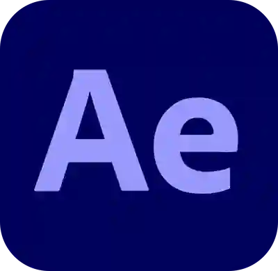
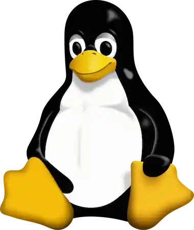
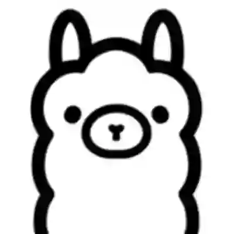

##  Hi there, I'm Ramón 
#### Creative Developer · Illustrator
>"Scratches, quirks and personality remind us there’s a human behind the screen"
---

## 📝 About Me

<table align="center">
  <tr>
    <td align="center">
      
       Computer Engineering 🎓 Student at UTN
    </td>
    <td align="center">
      
       Motion graphics  🎞️ Animator & editor
    </td>
    <td align="center">
      
       🎨 Digital illustrator
    </td>
  </tr>
</table>

## 🛠️ Skills

  
### Languages
<table align="center">
  <tr>
    <td align="center">
      
       TypeScript
    </td>
    <td align="center">
      
       Python
    </td>
    <td align="center">
      
       C++
    </td>
    <td align="center">
      
       C#
    </td>
  </tr>
</table>

### Tools

<table align="center">
  <tr>
    <td align="center">
      
       React
    </td>
    <td align="center">
      
       Git
    </td>
    <td align="center">
      
       Bash
    </td>
    <td align="center">
      
       Linux
    </td>
    <td align="center">
      
       Ollama
    </td>
  </tr>
</table>

## 🗃️ Currrently Proyects
-  [**Sophia AI**](https://github.com/RamonEnProceso/SOPHIA) – a locally-run interactive avatar that reacts in real time to user input, blending animation and conversational interfaces. Currently focused on expressive behavior, presence, and user experience rather than full AI autonomy.

-  [**El Vueltero’s Gallery**](https://github.com/RamonEnProceso/El-Vueltero-gallery) – a curated showcase of my digital illustration and animation work, blending personal expression with experimental visual storytelling.

-  [**Visualizador de Materias**](https://github.com/RamonEnProceso/visualizador-cursada-UTN) – a mobile-first web for UTN students to track their academic progress.

---

